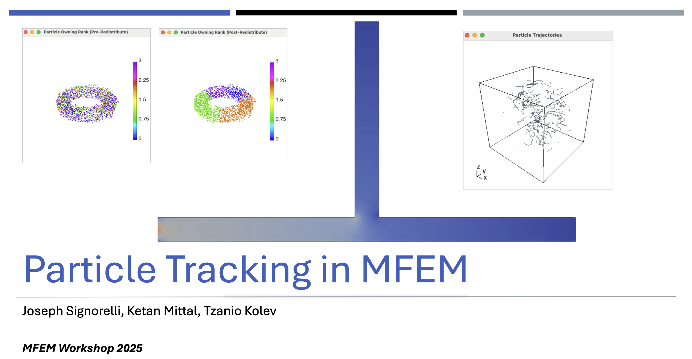
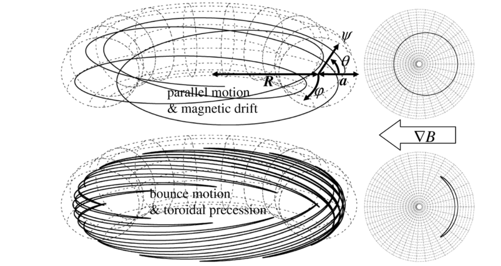
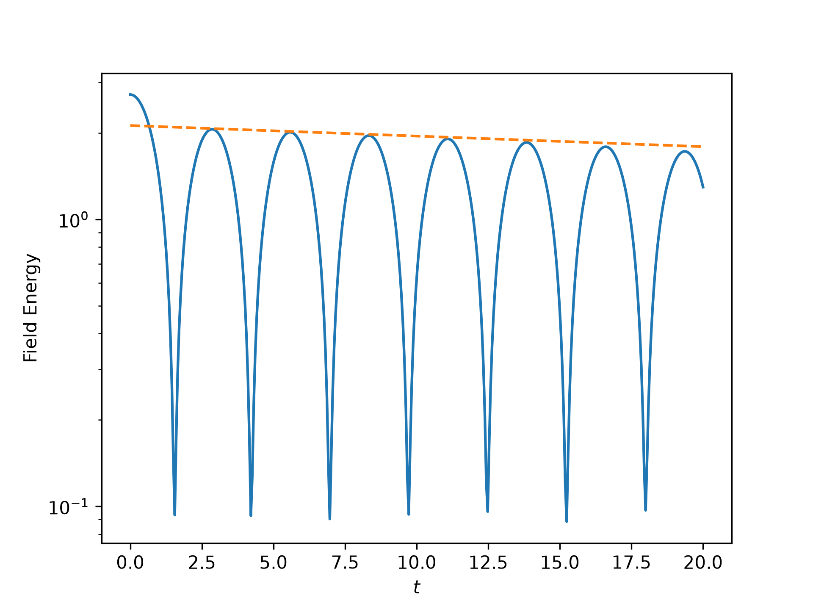
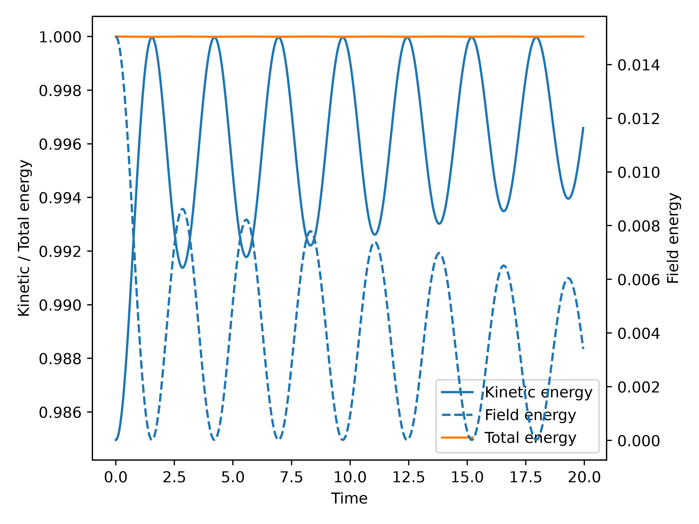
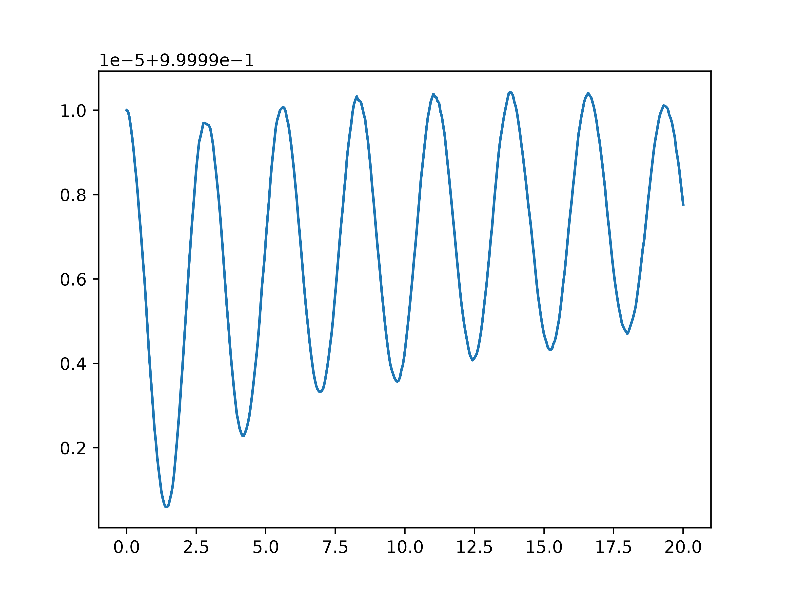
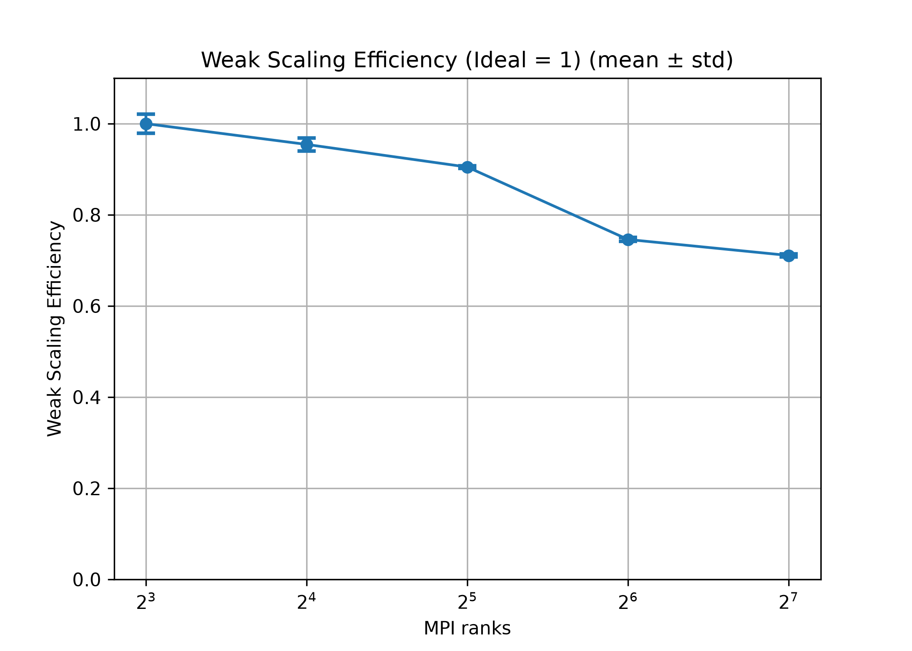
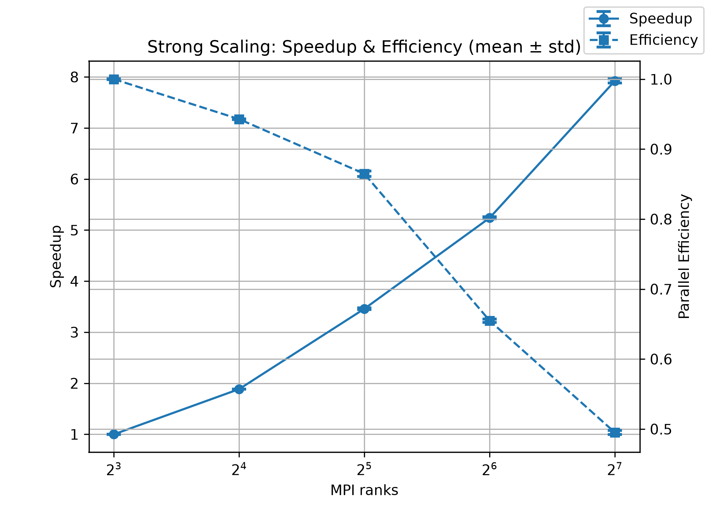

<!-- _class: lead no-header no-footer -->
<!-- _paginate: false -->

# Particle-in-cell in MFEM

Rushan Zhang, Joseph Signorelli, Ketan Mittal, Tzanio Kolev, Qi Tang

*MFEM Workshop 2026*

<!--
- Extend particle tracing in MFEM to electrostatic PIC
- Feedback: particle positions determine charge on the mesh
- The resulting electric field moves those same particles
- Focus: what we added, then validation and parallel scaling
-->

---

## Particle tracing in MFEM

<!--
- Last year's MFEM workshop: Joseph Signorelli, Ketan Mittal, Tzanio Kolev
- Their particle infrastructure is the starting point for this PIC work
- Already handles localization, field evaluation, motion, and MPI transfer
-->

---

## Particle tracing in MFEM

**Known field → particle trajectories**

Particles move through a field represented as an MFEM grid function.

> Particle tracing provides
> - **Particle class** with $\mathbf x$, $\mathbf p$, $m$ and $q$ etc.
> - **Localization** of particles in the mesh
> - **Interpolation** of fields at particle positions
> - **Boris** push for particle $\mathbf x$ and $\mathbf p$ updates
> - **Redistribution** of particles that cross subdomain boundaries

<video class="tokamak-video" src="figs/tokamak_demo_loop.mp4" autoplay loop muted playsinline></video>Tokamak magnetic field generated from: R. Zhang, G. Wimmer, Q. Tang. Structure-preserving transfer of Grad–Shafranov equilibria to magnetohydrodynamic solvers, Journal of Computational Physics, 568:115369, 2027.

---

## Particle tracing in MFEM

<video class="tokamak-video" src="figs/tokamak_demo_loop.mp4" autoplay loop muted playsinline></video>

X. Garbet, Y. Idomura, L. Villard, T. H. Watanabe. Gyrokinetic simulations of turbulent transport, Nuclear Fusion, 50:043002, 2010.
Tokamak magnetic field generated from: R. Zhang, G. Wimmer, Q. Tang. Structure-preserving transfer of Grad–Shafranov equilibria to magnetohydrodynamic solvers, Journal of Computational Physics, 568:115369, 2027.

<!--
- Example: particles moving in a Tokamak field
- Particle class carrying x, p, m, and q
- Localization of particles in the mesh
- Interpolation: find the finite element a particle is in and evaluate the field there
- (Specifically, find the element that a particle is in and evaluate the field at that point.)
- Boris push for x and p
- Redistribution when particles cross MPI subdomains
- Pause for the animation
- The field is given; particles follow it but do not change it
- That missing coupling is what PIC adds
-->
---
<!-- _class: divider -->

# The natural next step: particle-in-cell

$$
\text{particles}
\xrightarrow{\text{deposit charge}}
\text{field}
\xrightarrow{\text{push}}
\text{particles}
$$

Repeat this feedback loop at every time step.

<!--
- Close the loop: particles change the field that moves them
- Deposit particle charge onto the finite element mesh
- Solve for an electric field and use it to advance the particles
- Repeat at every time step
- Tracing becomes self-consistent PIC
-->

---

## Governing Equations

Consider the Vlasov–Poisson equation:

$$\frac{\partial f}{\partial t}+\mathbf v\cdot\nabla_{\mathbf x}f+\frac{e}{m}\mathbf E\cdot\nabla_{\mathbf v}f=0.$$

Distribution function approximated by macro-particles:

$$f\approx\sum_{p=1}^{N_p}\delta(\mathbf x-\mathbf x_p)\delta(\mathbf v-\mathbf v_p).$$

Integrate over velocity to get the charge density:

$$\rho(\mathbf x)=e\int f(\mathbf x,\mathbf v)\,d\mathbf v=e\sum_{p=1}^{N_p}\delta(\mathbf x-\mathbf x_p).$$

<!--
- Vlasov equation: evolve a distribution in position and velocity
- Represent it with macro-particles, not a phase-space grid
- Unit weight: no separate particle-weight factor
- Integrate over velocity: each particle is a point charge
- The sum of those charges is the charge density for Poisson
-->

---

## Governing Equations

Poisson's equation $-\epsilon_0\Delta\phi(\mathbf x)=\rho(\mathbf x)-\rho_0$ yields
$$-\epsilon_0\Delta\phi(\mathbf x)=e \sum_{p=1}^{N_p}\delta(\mathbf x-\mathbf x_p)-e n_0.$$

For a test function $\varphi\in H^1(\Omega)$, the finite element solve is

$$\epsilon_0\langle\nabla\varphi,\nabla\phi\rangle
=e\sum_{p=1}^{N_p}\varphi(\mathbf x_p)-e n_0\int_\Omega\varphi.$$

> `OrthoSolver` is needed to remove the constant nullspace of the periodic Poisson operator and ensure a unique solution for the potential $\phi$.

<!--
- Charge is the source for the electrostatic potential
- Weak form: a point charge contributes the test-function value at the particle
- Background term balances the reference charge
- Periodic Poisson has a constant nullspace
- OrthoSolver removes that mode and selects a potential representative
-->

---
## Governing Equations

The electric field satisfies $\mathbf E(\mathbf x)=-\nabla\phi(\mathbf x)$, so for a test function $\mathbf v\in H(\mathrm{curl};\Omega)$, we have

$$\langle\mathbf v,\mathbf E+\nabla\phi\rangle=0.$$

> The discrete de Rham complex gives a compatible gradient,
>
> $$
> \begin{array}{ccc}
> H^1(\Omega) & \xrightarrow{\nabla} & H(\mathrm{curl};\Omega) \\
> \downarrow & & \downarrow \\
> CG & \xrightarrow{\nabla_h} & ND
> \end{array}
> $$
>
> following which total energy can be shown to be conserved in the discrete PIC system.

<!--
- Electric field is the negative gradient of the potential
- Weak equation at the top: that relationship in H(curl)
- Compatible spaces: the gradient maps H1 into H(curl)
- MFEM preserves this between CG and Nedelec
- Compatible gradient implies discrete total energy conservation
- This is the mesh field evaluated at particles
-->

---

## One PIC time step in MFEM

1. **Deposit charge:** For $\varphi \in H^1(\Omega)$, assemble $e\sum_p\varphi(\mathbf x_p)$.

2. **Solve Poisson:** Solve $\epsilon_0\langle\nabla\varphi,\nabla\phi\rangle=e\sum_p\varphi(\mathbf x_p)-e n_0\int_\Omega\varphi$.

3. **Compute field:** $\langle\mathbf v,\mathbf E+\nabla\phi\rangle=0$.

4. **Gather field:** interpolate $\mathbf E$ at each $\mathbf x_p$.

5. **Leapfrog push:**
$$
\begin{aligned}
\mathbf p_p^{t+\frac12\Delta t} &= \mathbf p_p^{t-\frac12\Delta t}+e\mathbf E^t(\mathbf x_p^t)\Delta t,\\
\mathbf x_p^{t+1} &= \mathbf x_p^t+\frac{\mathbf p_p^{t+\frac12\Delta t}}{m_p}\Delta t.
\end{aligned}
$$

6. **Redistribute:** transfer particles that cross MPI subdomain boundaries.

<!--
- Six operations in one time step
- Deposit charge: evaluate H1 test functions at particles
- Solve periodic Poisson with OrthoSolver
- Compute E as minus grad phi
- Gather E at each particle
- Leapfrog: momentum by the electric force, then position with the new half-step momentum
- Electrostatic push here; tracing used Boris for a prescribed field
- Redistribute particles that cross MPI subdomain boundaries
- New positions produce the next charge density
-->

---

## Linear Landau damping

Field energy decays at a rate close to the reference rate.

256 MPI ranks · 20,000 particles per rank
64 × 64 grid · 400 steps · $\Delta t=0.05$

<!--
- Validate field-particle coupling with linear Landau damping
- Initial perturbation creates an electric field
- Field-energy oscillations decay over time
- Dashed line: reference damping envelope; simulation follows it
- 256 MPI ranks, 20,000 particles per rank, 64 by 64, 400 steps, dt = 0.05
- Deposition, Poisson, gathering, and motion together reproduce the expected damping
-->

---

## Linear Landau damping

Left: kinetic and field energy exchange. Right: total energy. (Both normalized by the initial total energy.)

<!--
- Same run; both plots normalized by the initial total energy
- Left: kinetic and field energy exchange; orange total nearly flat
- Right: total energy zoomed; vertical scale is a few ten-thousandths
- Blue curve oscillates; dashed fit shows a small drift
- Total energy stays close to its initial value
- Numerical diagnostic; leave structure analysis for another talk
-->

---

<!-- _class: results -->

## Parallel scaling

Left: weak scaling, 40,960 particles per rank. Right: strong scaling, 2,621,440 particles total. 
Both use 8–128 MPI ranks and a 64 × 64 grid. Tested on NERSC.

<!--
- NERSC, 8 to 128 MPI ranks
- Left: weak scaling, 40,960 particles per rank
- Ideal efficiency is 1; measured drops to about 0.56 at 128 ranks
- Right: strong scaling, 2,621,440 particles fixed
- Speedup about 6.4 at 128 ranks; efficiency around 0.4
- Field solve and particle redistribution both add cost as ranks increase
- Both studies: 64 by 64 mesh, 400 steps, dt = 0.05
-->

---

## Summary
- Scalable electrostatic PIC implementation in MFEM
- Validated with linear Landau damping

## On-going work
- Improving **scalability** on on CPU and **GPU** (See Eddy Luo and Elliot Day's poster presentation)
- Implementing a **shape function** beyond Dirac delta (See Rushan Zhang's poster presentation)

<!--
- Scalable electrostatic PIC in MFEM
- Landau damping checks the coupled particle and field calculation
- Scaling studies show MPI performance
- Ongoing: GPU support for deposition, gather, and push
- Eddy Luo and Elliot Day poster
- Thank you
-->

---

<!-- _class: divider -->

# Questions?

<video class="qa-video" src="figs/two_stream_demo.mp4" autoplay loop muted playsinline></video>

<!--
- Happy to take questions
- Video: two-stream PIC simulation
- Can run while we discuss the method or implementation
-->
